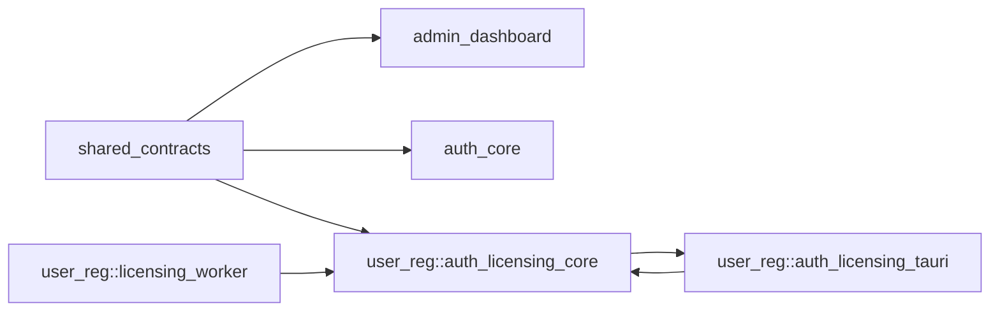
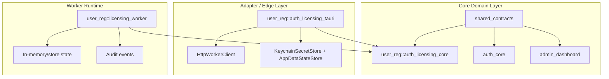
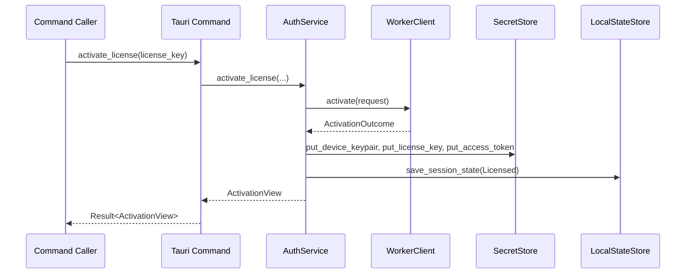
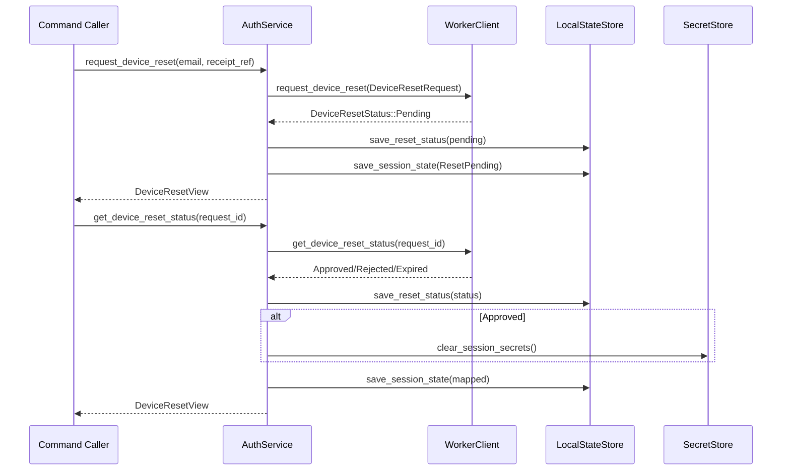
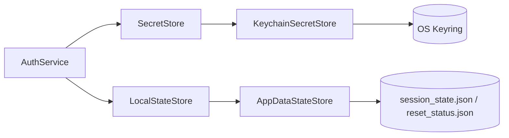
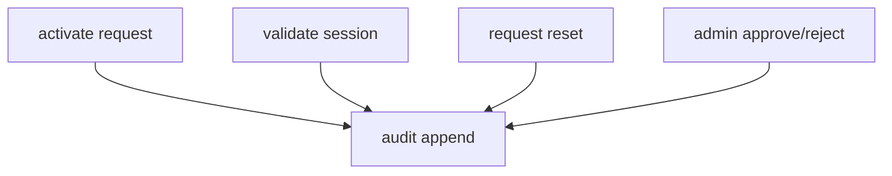
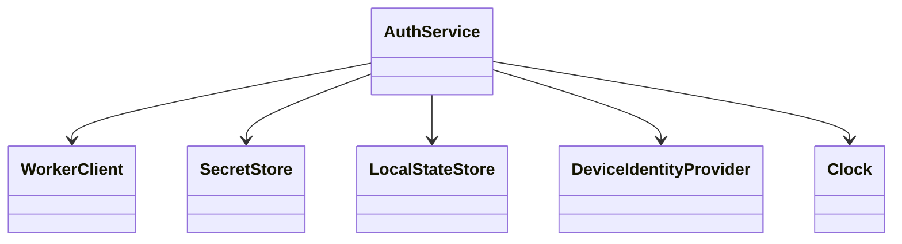
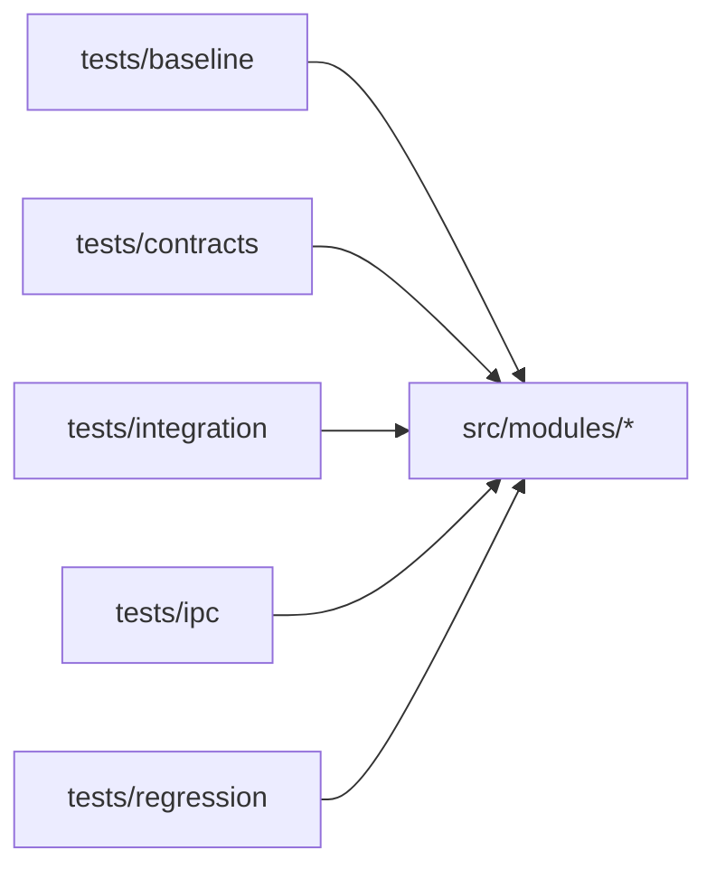
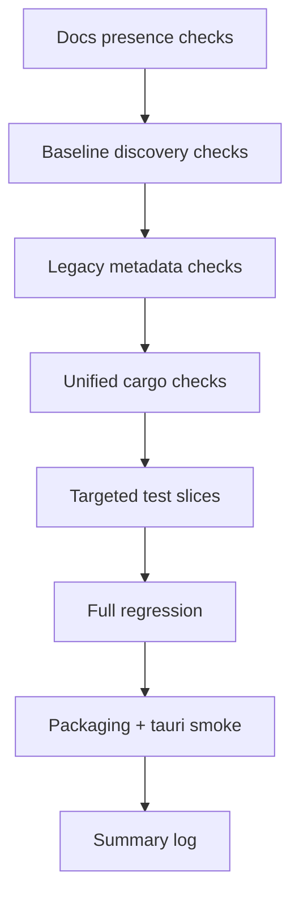

# license-control-suite

Unified Rust crate that merges four legacy domains into a single module-structured codebase:

- `shared_contracts`
- `admin_dashboard`
- `auth_core`
- `user_reg` (core + tauri adapters + licensing worker)

This repository is currently **crate-first** (library + binary skeleton) and not a full `src-tauri` shell project yet.

## Graphify Snapshot

Latest Graphify run (`graphify-out/GRAPH_REPORT.md`) reported:

- **550 nodes**
- **942 edges**
- **25 communities**
- extraction mix: **75% EXTRACTED**, **25% INFERRED**

This README is aligned with that graph and the current source tree.

## Repository Structure

```text
src/
  lib.rs
  main.rs
  modules/
    shared_contracts/
    admin_dashboard/
    auth_core/
    user_reg/
      auth_licensing_core/
      auth_licensing_tauri/
      licensing_worker/
tests/
  baseline/
  contracts/
  integration/
  ipc/
  regression/
docs/
  baseline/
  migration/
fixtures/
scripts/
```

## High-Level Architecture



## Module Boundary Map



## Tauri Command Surface

The unified command inventory is fixed at six commands:

- `activate_license`
- `validate_session`
- `request_device_reset`
- `get_device_reset_status`
- `clear_local_session`
- `get_auth_state`

```mermaid
flowchart LR
  UI[Frontend / Invoke Caller]
  CMD[auth_licensing_tauri::commands]
  SVC[AuthService]

  UI -->|invoke(command)| CMD
  CMD --> SVC
```

## Command-to-Core Flow



## Device Reset Flow



## Storage and Secret Responsibilities



## Worker Domain Flow



## Trait-Oriented Core Interfaces

`user_reg::auth_licensing_core` is designed around injectable traits:

- `WorkerClient`
- `SecretStore`
- `LocalStateStore`
- `DeviceIdentityProvider`
- `Clock`



## Test Topology



## Verification Pipeline

Primary orchestrator:

- `scripts/run_full_verification_logged.sh`

It executes ordered checks and writes per-command logs under `logs/verification_<timestamp>/`.



## Build and Test

### Fast local checks

```bash
cargo check
cargo test
```

### Full logged verification

```bash
bash scripts/run_full_verification_logged.sh
```

## Current Tauri Shell Status

This repo currently has command modules and IPC contracts, but no complete Tauri app shell (`src-tauri/tauri.conf.*`).

Implications:

- Rust module tests/builds can pass.
- Tauri packaging smoke commands can report `BLOCKED` until shell/config/capability files are added.

## Key Docs

- `docs/migration/final_regression_report.md`
- `docs/migration/final_acceptance_checklist.md`
- `docs/migration/handoff_summary.md`
- `../docs/unified_merge_unresolved_issues.md`
- `../docs/unified_merge_verification_runbook.md`

## Graph Artifacts

- `graphify-out/graph.json`
- `graphify-out/graph.html`
- `graphify-out/GRAPH_REPORT.md`

