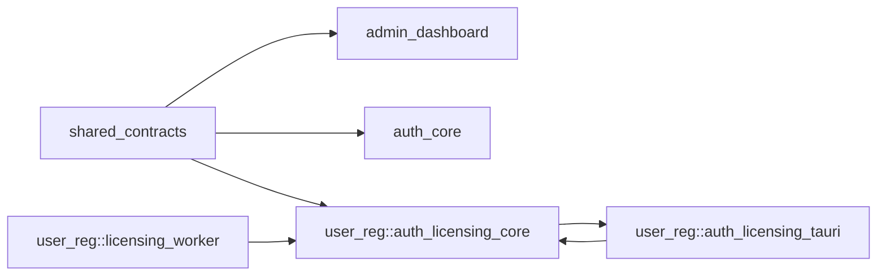
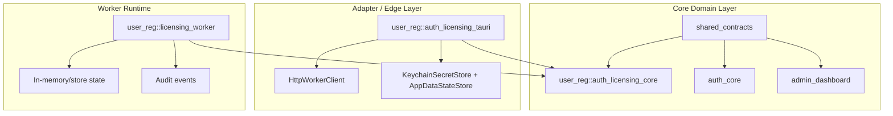
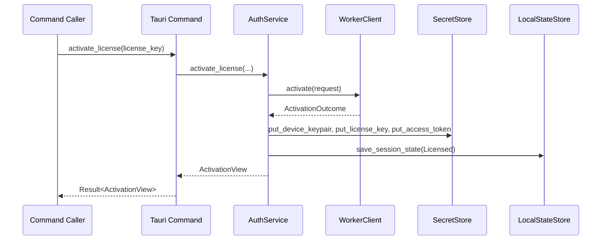
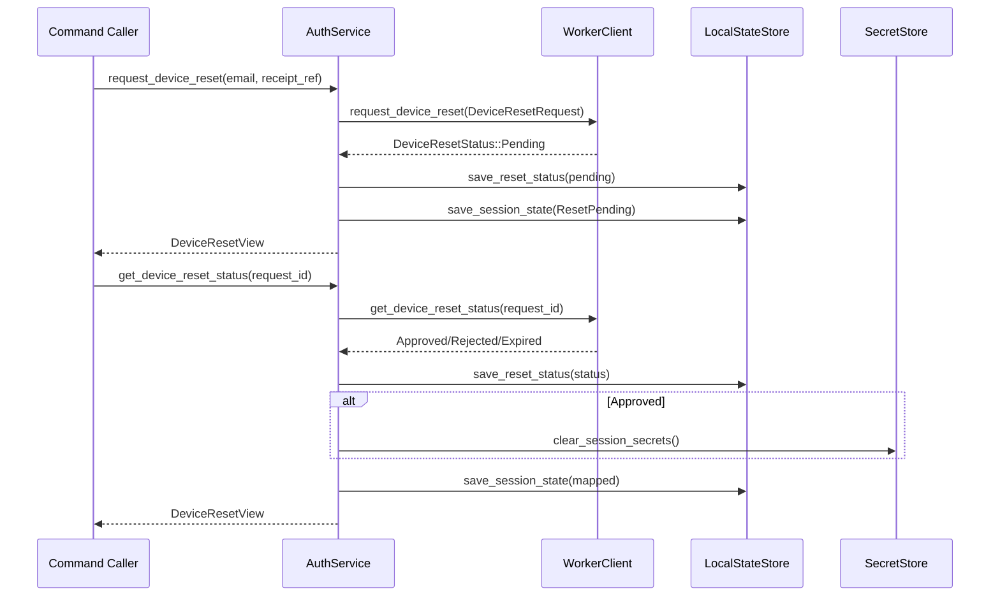
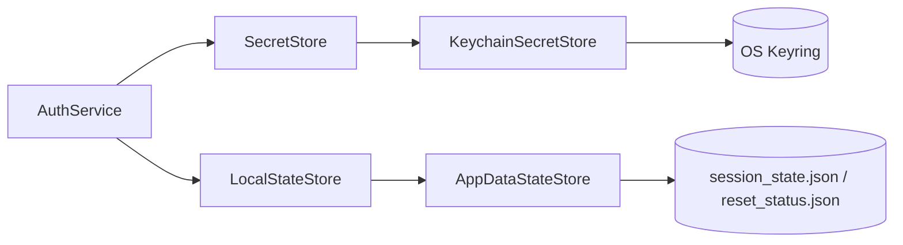
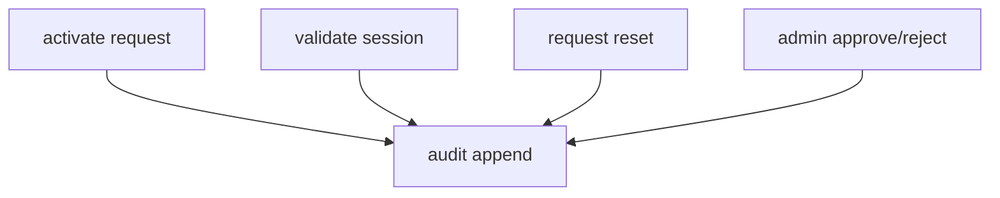
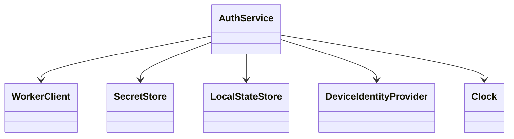
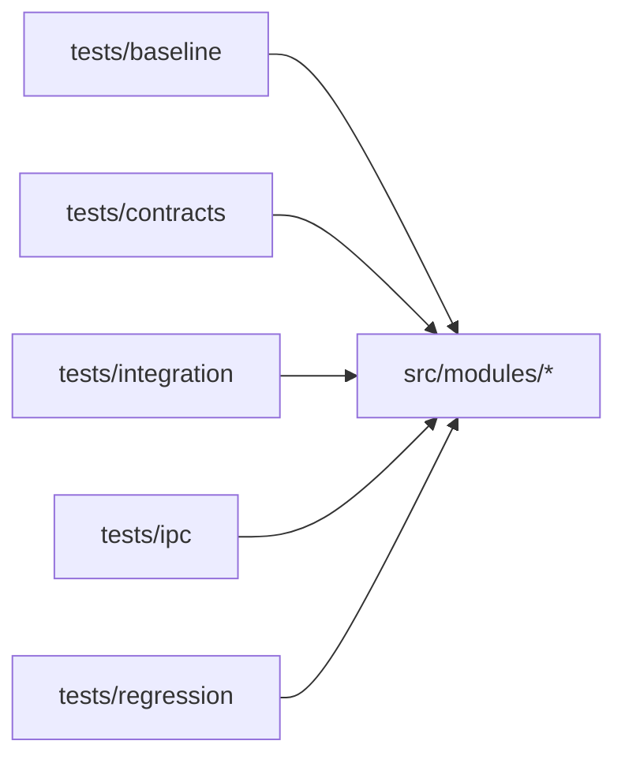
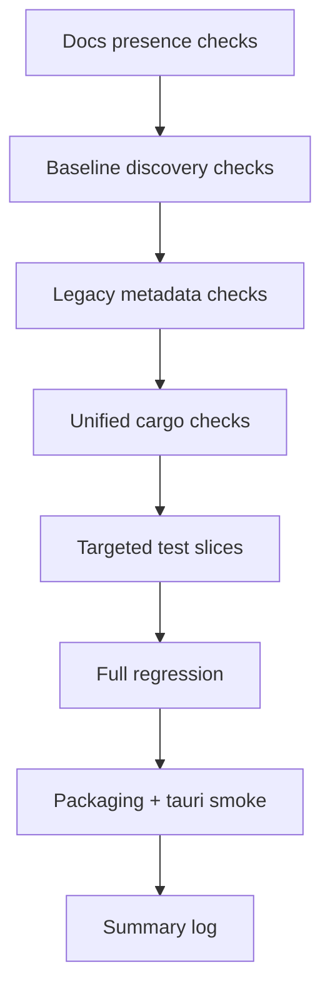

# license-control-suite

Unified Rust crate that merges four legacy domains into a single module-structured codebase:

- `shared_contracts`
- `admin_dashboard`
- `auth_core`
- `user_reg` (core + tauri adapters + licensing worker)

This repository is currently **crate-first** (library + binary skeleton) and uses minimal example Tauri desktop shells under `examples/` rather than a root `src-tauri` product shell.

## Use In Your Project

Use the crate through the curated public surfaces, not deep internal modules.

Core-only consumer:

```toml
[dependencies]
license-control-suite = { path = "../license-control-suite", default-features = false, features = ["core"] }
```

```rust
use license_control_suite::core::AuthService;
```

Desktop Tauri host consumer:

```toml
[dependencies]
license-control-suite = { path = "../license-control-suite", features = ["core", "desktop-tauri", "desktop-persistence"] }
```

```rust
use license_control_suite::desktop::tauri::auth_command_handler;

fn build_handler<R>() -> impl Fn(tauri::ipc::Invoke<R>) -> bool + Send + Sync + 'static
where
    R: tauri::Runtime,
{
    auth_command_handler::<R>()
}
```

Preferred imports for normal consumers:

- `license_control_suite::core`
- `license_control_suite::desktop::tauri`
- `license_control_suite::desktop::persistence`
- `license_control_suite::desktop::admin`

Validation layers for real adoption:

- internal crate verification: `bash scripts/run_ci_sequence_logged.sh verify`
- downstream dependency verification: `bash scripts/run_ci_sequence_logged.sh downstream-consumers`
- full logged local sequence: `bash scripts/run_ci_sequence_logged.sh all`

## Consumer Docs

The current onboarding path is documented in [docs/consumer_onboarding.md](docs/consumer_onboarding.md) and mirrored by compile-oriented examples under `examples/`.
Separate downstream dependency harnesses live under `fixtures/downstream_consumers/` and are documented in [docs/downstream_consumer_validation.md](docs/downstream_consumer_validation.md).
That downstream layer now covers path-based, git-based, and packaged-consumer validation separately from the crate's own components.
Release gating for first external integration or publication is documented in [docs/release_readiness_checklist.md](docs/release_readiness_checklist.md).
The recommended CI sequencing for those gates is documented in [docs/ci_job_sequence.md](docs/ci_job_sequence.md).
The unified logged runner for that sequence is `bash scripts/run_ci_sequence_logged.sh all`.

Primary example entry points:

- `examples/core-only.rs`
- `examples/fake-dependency-injection.rs`
- `examples/desktop-tauri-host.rs`
- `examples/host-command-composition.rs`
- `examples/admin-desktop-console.rs`

## Preferred Import Paths

Consumers should prefer the curated crate-level facades:

- `license_control_suite::core`
- `license_control_suite::desktop::tauri`
- `license_control_suite::desktop::persistence`

The older `license_control_suite::modules::...` paths remain available as transitional compatibility imports.

`license_control_suite::core` is the canonical client auth/licensing path for new integrations.
`modules::auth_core` and `modules::shared_contracts` remain compatibility-oriented surfaces, while `modules::admin_dashboard` remains a separate desktop admin domain and not the canonical client auth core.

## Feature Flags

| Feature | Purpose |
| --- | --- |
| `core` | Enables the canonical client auth/licensing core. |
| `desktop-tauri` | Enables Tauri command wiring and the HTTP desktop adapter surface. |
| `desktop-persistence` | Enables desktop persistence and keyring-backed secret storage. |
| `reference-worker` | Enables the local/native reference worker domain. |

Default features:

`["core", "desktop-tauri", "desktop-persistence", "reference-worker"]`

Desktop-only remains the supported runtime even though reduced builds can omit Tauri-facing surfaces.

## Reference Backend

`license_control_suite::reference_worker` is a local/native reference backend for testing and contract reasoning. It is not a production Cloudflare runtime target or a current Gumroad-integrated provider backend.

Deferred backend/provider work remains out of scope:

- Cloudflare runtime adapter
- Gumroad provider adapter
- payment verification
- webhook ingestion
- durable backend storage

## Admin Desktop Boundary

`license_control_suite::desktop::admin` is a desktop-only admin console surface. It is not a web dashboard target, and it remains separate from the six user/client commands.

## Admin Desktop Console Onboarding

Admin desktop consumers should start from `license_control_suite::desktop::admin`, keep admin flows separate from the six client auth commands, and use the example shell layout under `examples/admin-desktop-shell/`.

## Desktop Persistence Namespacing

- `AppDataStateStore::new(root)` preserves the legacy compatibility filenames.
- `AppDataStateStore::with_namespace(root, "desktop-client")` writes:
  - `desktop-client.session_state.json`
  - `desktop-client.reset_status.json`
- `KeychainSecretStore::new_for_app(service_name)` preserves the legacy key names.
- `KeychainSecretStore::with_namespace(service_name, "desktop-client")` derives:
  - `desktop-client.license_key`
  - `desktop-client.access_token`
  - `desktop-client.device_keypair`

Secrets stay in keyring-backed storage. Non-secret state stays in JSON.

## Tauri Command Composition

For host desktop apps, the recommended pattern is to compose the public command functions into the app's own final `tauri::generate_handler!` invocation. `register_auth_commands()` remains available as a convenience helper when the auth command set is the only handler group being registered.

## Client Desktop App Onboarding

Client desktop consumers should:

1. Start from `license_control_suite::core`, `license_control_suite::desktop::tauri`, and `license_control_suite::desktop::persistence`.
2. Use the minimal shell layout under `examples/client-desktop-shell/`.
3. Compose the six auth commands in the host shell rather than treating the crate as the final app shell.
4. Use namespaced JSON state and namespaced keyring entries when shipping multiple desktop shells on one machine.

## Unsupported and Deferred Capabilities

The current desktop-only scope does not include:

- web apps
- mobile apps
- Cloudflare runtime
- Gumroad integration
- payment flows
- hosted SaaS backend

Those remain unsupported or deferred. This repository does not currently provide a browser frontend, mobile app, hosted backend, or production provider/runtime integration outside the local/native reference worker.

## Repository Structure

```text
src/
  lib.rs
  main.rs
  modules/
    shared_contracts/
    admin_dashboard/
    auth_core/
    user_reg/
      auth_licensing_core/
      auth_licensing_tauri/
      licensing_worker/
tests/
  baseline/
  contracts/
  integration/
  ipc/
  regression/
docs/
  baseline/
  migration/
fixtures/
scripts/
```

## High-Level Architecture



## Module Boundary Map



## Tauri Command Surface

The unified command inventory is fixed at six commands:

- `activate_license`
- `validate_session`
- `request_device_reset`
- `get_device_reset_status`
- `clear_local_session`
- `get_auth_state`

```mermaid
flowchart LR
  UI[Frontend / Invoke Caller]
  CMD[auth_licensing_tauri::commands]
  SVC[AuthService]

  UI -->|invoke(command)| CMD
  CMD --> SVC
```

## Command-to-Core Flow



## Device Reset Flow



## Storage and Secret Responsibilities



## Worker Domain Flow



## Trait-Oriented Core Interfaces

`user_reg::auth_licensing_core` is designed around injectable traits:

- `WorkerClient`
- `SecretStore`
- `LocalStateStore`
- `DeviceIdentityProvider`
- `Clock`



## Test Topology



## Verification Pipeline

Primary orchestrator:

- `scripts/run_ci_sequence_logged.sh`

It executes ordered checks and writes per-command logs under `logs/ci_<mode>_<timestamp>/`.



## Build and Test

### Fast local checks

```bash
cargo check
cargo test
```

### Full logged verification

```bash
bash scripts/run_ci_sequence_logged.sh all
```

## Current Tauri Shell Status

This repo currently has command modules, IPC contracts, and minimal example Tauri desktop shells under:

- `examples/client-desktop-shell/src-tauri`
- `examples/admin-desktop-shell/src-tauri`

Implications:

- Rust module tests/builds can pass.
- Tauri packaging smoke and capability checks now target the example-shell layout.

## Key Docs

- `docs/migration/final_regression_report.md`
- `docs/migration/final_acceptance_checklist.md`
- `docs/migration/handoff_summary.md`
- `../docs/unified_merge_unresolved_issues.md`
- `../docs/unified_merge_verification_runbook.md`
